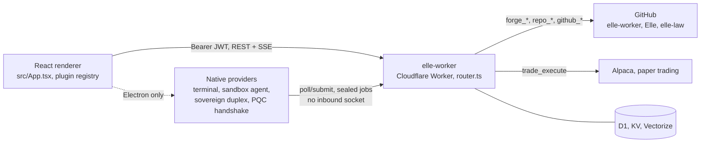

# Elle · Workbench

**The admin console for Elle.** A React + Vite renderer that ships two ways
from one codebase — an Electron desktop app with native OS integrations, and
a static web build deployed on every push to `main` — behind one login gate,
one plugin-registry rail, and one source of truth for what Elle can actually
do.

[](https://github.com/sbarteau2022/Elle/actions/workflows/ci.yml)
[](https://github.com/sbarteau2022/Elle/actions/workflows/elle-deploy.yml)


This is a **glass, not a brain**: Elle herself — voice, memory, tools,
autonomous loops — is the `elle-worker` Cloudflare Worker; this app is a
window onto it. For the mind/router/conductor architecture, read that repo's
[`README.md`](../elle-worker/README.md). This one documents the console —
**the one console.** The old cloud dev console (`elle-dev-console`) is
deprecated; everything it did lives here, plus the surfaces it never had:
the autonomous conductor, the trading desk, the corpus library, the tax
suite, and her identity, read straight from source.

---

## Table of contents

- [Architecture](#architecture)
- [Access & security](#access--security)
- [Feature surfaces](#feature-surfaces)
- [Tool catalog](#tool-catalog)
- [Post-quantum key exchange](#post-quantum-key-exchange)
- [Getting started](#getting-started)
- [CI/CD](#cicd)
- [Worker integration](#worker-integration)
- [Project structure](#project-structure)
- [File map](#file-map)
- [Desktop shortcut](#desktop-shortcut)
- [Scripts reference](#scripts-reference)

---

## Architecture



Three things worth knowing before anything else:

1. **The renderer never talks to a database, a model, or a broker directly.**
   Every panel is a thin client over one worker endpoint, authenticated with
   a per-user Bearer JWT (see [Worker integration](#worker-integration)). The
   renderer holds no service keys and makes no decisions Elle didn't make.
2. **The rail is a plugin registry, not a fixed list.**
   `src/plugins/builtins.tsx` registers every panel via `registerPanel()`;
   `App.tsx` only ever reads `listPanels()`/`listSections()` back out
   (`src/plugins/registry.ts`). A third-party panel plugs in the same way,
   with zero changes to `App.tsx`.
3. **Electron adds a native process behind the identical UI — it doesn't
   replace it.** The terminal, the connect-back sandbox agent, the sovereign
   (local-Ollama) duplex, and the PQC handshake all live in
   `electron/native/providers/` behind `window.elleNative`
   (`electron/preload.cjs`). The plain web build simply doesn't expose that
   bridge, so those surfaces degrade — a badge, a disabled button — rather
   than break.

---

## Access & security

- **Admin-tier only, wherever it runs.** A per-user JWT is obtained from
  `/api/elle-auth`, and the tier is checked twice: at login (`Login.tsx`) and
  on every mount via a network-backed `verifyToken()` (`lib/elle.ts`). A
  valid *standard*-tier session (the mobile app's tier) is refused at the
  door — this is her cockpit, not a member surface. Three tiers open it:
  `superadmin`, `admin`, and `cofounder`.
- **Two deployments, one gate.** The Electron build is what you run locally
  against the deployed worker. The web build (`npm run build`, no Electron)
  is deployed publicly by `.github/workflows/elle-deploy.yml` to Cloudflare
  Workers static assets (`wrangler.toml`, Worker name `elle` — a separate
  deployment from `elle-worker`, the backend). Being reachable is not being
  open: every panel still needs the admin-tier login, no service key ships
  in the bundle, and the Electron-only surfaces below simply aren't there in
  a browser tab.
- **Electron-only surfaces.** Anything that needs a native process — the
  integrated **terminal**, the connect-back **sandbox agent** that polls the
  worker's session bus, the **sovereign duplex** (local Ollama), the optional
  macOS head-motion addon — depends on `window.elleNative`
  (`electron/preload.cjs`). The web build simply doesn't expose that bridge;
  those tabs degrade rather than break.
- **`cofounder`** is a trusted second admin: full visibility here (every panel,
  every read), but the worker runs him at a restricted scope that blocks only
  the **code-shipping tools** (`forge_open`/`forge_write`/`forge_pr`,
  `run_shell`, `delegate_local` — `SHIP_DENY` in `EllePanel.tsx`, mirroring
  the worker's own deny set) — he can see and reason over all her code, but
  cannot ship or migrate it, and can't hand a goal to the local peer agent
  that would execute shell commands on his behalf either. His tool-chip list
  hides those tools so the count stays accurate.
- **Forced first-login reset.** A provisioned (temp-password) account is held at
  a "set your password" step before the console opens.
- Auth persists in `localStorage` (30-day token). **Sign-out revokes the
  token server-side** (`{action:'logout'}` on `/api/elle-auth` deletes its
  `jti` from `AUTH_TOKENS`) before clearing local state — a lingering or
  stolen copy stops working immediately instead of riding out its 30-day
  expiry. The Login tier-gate does the same for a freshly-minted token it
  has to reject.

---

## Feature surfaces

*Left rail, grouped mind / work / ops. ⌘/Ctrl+1..9 jumps straight to a tab.*

The rail is a plugin registry, not a fixed list — `src/plugins/builtins.tsx`
registers every panel below via `registerPanel()`, and `App.tsx` only ever
reads `listPanels()`/`listSections()` back out (`src/plugins/registry.ts`).
A third-party panel would plug in the same way, no change to `App.tsx`.

At 20 registered panels, the rail earns its own UX: a **filter box** above
the nav narrows the list by label as you type (Enter jumps straight to a
sole match, Escape clears), and each of the three groups **collapses**
independently — click the group header, state persists in `localStorage`
(`elle_rail_collapsed`). A group with a filter match forces itself open even
if you'd collapsed it, so filtering never hides the result. The nav column
scrolls on its own too, so the group headers and the pinned
theme/terminal/sign-out block at the bottom never get pushed off-screen by
tab count.

### mind

| Panel | What it does |
| --- | --- |
| **elle** | The unified conversation. Every turn runs the full-scope router (`/api/elle-router`): the full [tool catalog](#tool-catalog-full-scope---110-tools-across-16-groups), and she picks the tool *and* the model tier per step. A stable per-browser `session_id` gives her continuity across turns. The κ header above the thread is her live coherence readout; each answer carries a folded tool timeline you can open to watch the reasoning. A **prose-register selector** in the header swaps her voice for the conversation — five registers served live from `/api/elle-voices` (`mind.ts`): Stewart · Einstein · Attenborough · Lewis · Iglesias · Screwtape — without touching her self. A **voice orb** (Web Speech TTS/STT, optionally ElevenLabs for TTS — see `.env.example` — plus AirPods head-pose presence on macOS, Electron only) lets you talk to her out loud. The folded "N tools she can reach" panel lists the whole catalog, grouped exactly as the worker renders it, and a raw-JSON tool observation or answer renders as formatted, monospace JSON rather than being run through markdown's `**`/`` ` ``/`_` rules it wasn't written for. A **local/cloud toggle** (`prefer: 'local'`) can route a whole turn to the sovereign Ollama model instead of the cloud engines, when the sandbox agent is connected. |
| **conductor** | Her autonomous work (`/api/elle-intents`). Left: the intent queue — standing goals (yours file active; hers arrive as proposals to activate/pause). Right: the run log — every unprompted run with its outcome and full tool trace, so the morning shows what she did overnight. |
| **library** | The corpus and everything she writes. Type to filter titles; **describe a document and press Enter to pull the whole thing by meaning** (`/api/corpus-resolve`, no title needed); filter by series; toggle to her dream/libre artifacts. Full-text reader on the right. |
| **research** | A dedicated reading room scoped to her autonomous research output only (the `research` series, hourly cron), listed newest-first in a manuscript-style reader — no search bar or series picker, unlike library. |
| **identity** | Her voice, fetched verbatim from the worker (`/api/elle-voices` → `mind.ts`). It's a mirror, never a copy: there is exactly one source of the prose, and it's the worker. Edited only through the forge. |
| **mirror** | `/api/elle-self` in one view: bets + calibration, scars, watches, dead drops, metabolism, consolidation, self-forged tools — the reflexive organs in one snapshot. |
| **atlas** | Her memory graph, in three dimensions (`react-force-graph-3d`). Node positions are computed entirely outside Elle, by a separate on-device repo that folds recall events into edges and pushes a versioned snapshot to the worker; this panel only ever `GET`s `/api/atlas/latest` (and `/history` / `/at` to scrub past snapshots) — the same read-only boundary the `atlas` router tool has. Gold edges are on a cycle (recurrence); oxblood edges are bridges. |

### work

| Panel | What it does |
| --- | --- |
| **optimus** | The phase-state journal: her manuscript threads with the κ series (κ · Σκ reserve · velocity · accel · jerk) and the coherence-function explainer. |
| **trading** | Her desk (`/api/elle-trading`, read-only): live account tiles, open positions, recent trades **with the reasoning that placed each one and what she was testing**, active theses, and her trading journal. She trades on the cron; this is the window. |
| **tax** | The small-business tax suite, as five tabs (onboarding / dashboard / transactions / contractors ("1099s") / credits). Onboarding is just this panel's default tab until a business exists — no separate wizard. Talks to two doors: `/api/tax/data` (structured JSON, no LLM round trip — every tab's lists/tables/calculations) and `/api/tax/onboarding` (business + fact-group CRUD). The conversational `/api/tax` door — actually asking Elle about it — isn't used by this panel; that's reachable through the **elle** chat panel like any other tool. |
| **code** | The code-engine bench (analyze / debug / refactor / explain / generate / migrate). |
| **terminal** | Real shells on this machine, the way an IDE has them. Full `zsh`/`bash`/`cmd` sessions through a true PTY: prompts, colors, readline editing, `vim`, `htop`, `ssh`, `git`, `npm run …` — all of it. Multiple tabbed shells, each spawned as a login shell so `PATH` matches the terminal you already use. **⌃`** toggles the same shells as a drawer under *any* panel, dragged to whatever height you want — start a build in the drawer, go read the corpus, come back and it's still streaming. Sessions live outside React (`src/lib/terminals.ts`), so switching tabs or hiding the drawer never restarts a shell or loses scrollback. Electron only (needs `window.elleNative.terminal` from `electron/native/providers/terminal.cjs`); without native `node-pty` it falls back to piped shells and says so with a `piped · no tty` badge. |
| **evals** | The eval / training bench. |
| **forge** | The whole build pipeline in one tab, as four sub-tabs (`MasterForgePanel.tsx`; the sub-tab bar flashes if *sandbox* has an unseen report or *duplex* has an unseen message — the two sub-panels that used to flash on their own when they were separate rail tabs):<br>• *ideas* — her to-explore queue and the build lane (queued → scoping → spec → building → testing), with PFAR fingerprints per idea; "ship to the sandbox" jumps straight to the *forge* sub-tab's live stream.<br>• *forge* — take a tool into the sandbox and iterate it out, watched live: left is what she's building (code + goal pass/fail per iteration), right is her reasoning, the heavy-model review verdict, and the resulting PR. Fed by `/api/elle-forge` (SSE).<br>• *sandbox* — the connect-back box, watched live (`/api/elle-sandbox-runs`). Path OPEN/CLOSED status (host, platform, root, last beat) at the top; every `run_code`/`run_shell`/`sandbox_clone` call with its real stdout/stderr/exit; what she's cloned in; reports she surfaces from a sandbox session. **This is the console for "is the local sandbox actually working."**<br>• *duplex* — the standing line between her two persistences: the **sovereign** (the local Ollama model, running continuous and free on this machine via the `sovereignDuplex` provider) and the **cloud** (the heavy engines + meta-observer). An append-only ledger (`/api/duplex`) either side `say`s or `observe`s on; this tab tails it live. |
| **toolkit** | Her bucket of skills and the MCP connector shelf, as two sub-tabs (`ToolkitPanel.tsx`, same one-rail-slot-for-related-surfaces pattern as *forge*): neither `skill_list`/`skill_read`/`skill_write` nor `mcp_library`/`mcp_add`/`mcp_tools` has a dedicated REST door (they're router tools, like `trade_execute` or `forge_write`), so this panel reaches them the same way the elle chat panel does — an imperative ask to `/api/elle-router`, with the named tool's raw observation pulled out of the returned trace (`src/lib/toolCall.ts`), on a scratch session id that's kept separate from your actual conversation thread.<br>• *skills* (`SkillsPanel.tsx`) — the index (`skill_list`), read one by name (`skill_read`), and a form to teach her a new one (`skill_write`).<br>• *mcp* (`McpPanel.tsx`) — the curated connector shelf (`mcp_library`), what's mounted right now (`mcp_tools`), and a form to mount one by name (`mcp_add`). |
| **falcon** | The workbench face of the worker's `falcon.ts`: point it at a direction (a market, a problem, a domain, an idea) and it fires 16 axes across three tiers (Material Ground → Observer Reading → Validation, then the Rupture) in one call, filling in an honest crawl while the request is in flight. Every run is archived; a completed Rupture has an outcome form that records what actually got built, against what the engine named. |
| **flock** | The social-media intelligence studio, the workbench face of the worker's `flock.ts` (`/api/flock`). The **brand kit** owns the left rail (mission, voice, palette, fonts, audience, visual style, taboos); four tabs on the right condition on it: *studio* (brief → on-brand concepts → captions, each gate-checked by the **Brand Guardian** — a 0–100 continuity score with a per-dimension breakdown and concrete fixes); *image* (brand-conditioned generation + AI edit; a status strip flips to "sovereign" when a self-hosted image model is wired on the worker); *flock* (manage the channel roster, draft a post, pick channels, review for continuity, then publish — dry-run per channel until OAuth is added); *assets* (everything generated for the active brand). |

### ops

| Panel | What it does |
| --- | --- |
| **diagnose** | Paste an error or stack trace, get the on-stack fix (`/api/diagnose`). |
| **health** | Live status of `elle-worker` + both RAPID²AI workers (`rapid2ai-ai`, `rapid2ai-ingest`), polled every 30s. |
| **security** | The adversarial security network's tactical dashboard, reading the worker's admin-gated `/api/elle-security-status`: the rolling ledger of classified signals (auth failures, SSRF blocks, cyber findings, malware uploads), posture spread across recent actors, and which doctrine tactics (48 Laws + Art of War, read as attacker tactics) have fired. Self-polling, read-only; flashes on a blocked posture. |

A breathing gold heartbeat in the rail polls `/health` every 30s — the room
tells you she's alive before you say anything.

---

## Tool catalog

*Full scope — 110 tools across 16 groups.*

The **elle** panel opens the `full` scope — the worker's complete tool
catalog. Nothing is gated in the workbench because the workbench is
superadmin-only; the gating happens at the worker's public/member doors, not
here. The chip list in `EllePanel.tsx` mirrors the worker's `router.ts`
`TOOL_TREE`/`TOOL_LINES` exactly — same 16 groups, same order, every tool
accounted for (see the comment above the `TOOLS` array, which exists
specifically so this table and the worker's source can be diffed against
each other and never drift again):

| Group | Tools |
| --- | --- |
| **Mind & memory** | `search_corpus`, `find_document`, `fetch_document`, `read_sql`, `recall_memory`, `remember`, `notebook_write`, `self_state`, `memory_stats`, `scratchpad_read`, `scratchpad_write`, `page_read` |
| **World** | `web_search`, `deep_research`, `fetch_url`, `calc`, `diagnose`, `code_engine` |
| **Real execution** (the connect-back sandbox) | `run_code`, `run_shell`, `sandbox_status`, `sandbox_clone`, `sandbox_report`, `delegate_local`, `sandbox_lane` — no inbound socket: the Electron app POLLS the worker's session bus for sealed jobs on an interval and executes them via `child_process`, sealing results back the same way. Watch it live in **forge → sandbox**. Path closed ⇒ the tools report that plainly rather than hanging — see elle-worker's `docs/SESSION_BUS.md`. |
| **Her codebase & the forge** | `repo_read`, `repo_search`, `github_read_file`, `github_list_files`, `github_search_code`, `forge_open`, `forge_write`, `forge_check`, `forge_pr` |
| **Skills** | `skill_list`, `skill_read`, `skill_route`, `skill_write` |
| **MCP** | `mcp_library` (the curated connector shelf — mount by name), `mcp_add`, `mcp_tools`, `mcp_call` |
| **Hospitality** (native `rapid2ai-db`) | `rapid_report`, `rapid_costs`, `rapid_variance`, `rapid_pos`, `rapid_menu` |
| **Small business tax suite** | `tax_business_create`, `tax_business_list`, `tax_unit_add`, `tax_unit_list`, `tax_owner_set`, `tax_owner_list`, `tax_facts_update`, `tax_facts_status`, `tax_transaction_add`, `tax_transaction_list`, `tax_report`, `tax_1099_contractor_add`, `tax_1099_contractor_list`, `tax_estimate_quarterly`, `tax_schedule_c_prep`, `tax_credits_finder`, `tax_deadline_next`, `tax_reminder_ack`, `payroll_connection_status`, `payroll_sync`, `payroll_wage_summary` — the same suite the **tax** panel drives structurally; these are the conversational door onto it. |
| **Autonomy & standing work** | `idea`, `intent`, `review_runs`, `duplex`, `self_schedule`, `watch`, `dead_drop` |
| **Provenance & self-audit** | `provenance` (replay a run's ordered step stream or trace where an answer came from), `constraint_analyzer` (the single binding constraint), `fork_replay` (counterfactual replay of a past run), `metabolism` (provider health + latency), `validate_kappa` (pre-registered κ validation, ROC-AUC) |
| **Signal & geometry engines** | `pfar` (spectrum·prosody·rhetoric on a stream), `pami`, `vfar` (PFAR's twin, pointed at images), `hyper`, `torus`, `recall_ab`, `structure`, `product`, `atlas` — the geometry stack behind the **atlas** panel's 3D graph |
| **Journal** | `journal_read`, `journal_thread`, `journal_write`, `journal_annotate` |
| **Education** (course sessions) | `edu_enroll`, `edu_brief`, `edu_log`, `edu_seal`, `edu_complete`, `edu_status` |
| **Judgment on retainer** | `predict` (bet ledger vs. herself), `devil` (adversary on retainer), `council` (three engines, disagreement map), `scar` (recorded injuries that warn), `consolidate` (sleep pass), `tool_forge` (grow her own tools, sandboxed), `advisor` (consult a stronger reviewer model) |
| **Reach** | `reach_out` — a push notification to a person's phone, plus the same words in their thread with her; their contract (weekly budget, quiet hours, an auditable ledger) governs it absolutely |
| **Writes / sensitive** | `ingest_paper` (2-check gate), `trigger_dream`, `trade_execute` — equities (buy/sell/short/cover/close) and options (calls/puts, buying or writing, resolved from a target strike rather than a raw OCC symbol) on the paper Alpaca account; no hard position-size caps, same reasoning-is-the-gate model as the rest of the desk |

The single source of the catalog is the worker's `router.ts`; the chip list
in `EllePanel.tsx` is hand-kept in step with it (see the comment above the
`TOOLS` array). For each tool's exact signature and the scope model, read the
worker's [`README.md`](../elle-worker/README.md) → **the tools section**.

**The second brain.** `delegate_local` hands a whole GOAL to a genuine peer
agent that runs **entirely in this app**, not the worker:
`electron/native/providers/local-react-agent.cjs` orchestrates its own ReAct
loop on the laptop's Ollama model, with the same tool catalog the cloud
router has (minus a few tools that would only ever recurse back into itself —
`LOCAL_LOOP_DENY` in the worker's `router.ts`). `run_shell`/`run_code`
execute natively, right here, through `sandbox-agent.cjs`'s existing boxed
exec; every other tool is a plain HTTPS call to the worker's
`POST /api/elle-tool`, authenticated with the same `ELLE_SANDBOX_KEY` the
session bus uses. One job (`kind:'react_goal'`) carries the whole goal down;
one result comes back when it's done.

**GitHub reach.** The forge and `github_*`/`repo_*` tools run on the worker's
`GITHUB_TOKEN`. Its allowlist is `elle-worker`, `Elle`, `elle-dev-console`, and
`elle-law` — so from this console she can read the Elle.law repo and cut
`elle/*` work branches against it. She never merges; every merge is a human
click on GitHub.

---

## Post-quantum key exchange

*Laptop side.*

`electron/native/providers/pqc-hybrid.cjs` is a byte-for-byte port of
elle-worker's ML-KEM-768 + X25519 hybrid KEM (`K = HKDF-SHA256(ss_mlkem ||
ss_x25519, info = transcript)`), using the same audited, pure-JS packages
(`@noble/post-quantum`, `@noble/curves`) so results are bit-identical on
workerd and on Node. It's phase 1 of a PQC migration for
`rosen-bridge.cjs`/`lane-envelope.ts` (the sealed session-bus channel between
this app and the worker) — the hybrid KEM lands and is cross-runtime tested
before any lane-derivation cutover. Each repo generates and commits its own
interop vectors for the other side to verify against
(`pqc-hybrid.test.cjs`), rather than a build-time cross-repo dependency.
`electron/native/providers/lane-handshake.cjs` wires the hybrid KEM into the
live session-bus poller as the laptop-side initiator of that handshake.

---

## Getting started

### Requirements

- Node.js 20+ (`.github/workflows/ci.yml` runs Node 20 for the typecheck/test
  job; `elle-deploy.yml` uses Node 24 because `wrangler` requires it — either
  works fine for local dev).
- macOS only for the optional head-motion addon
  (`electron/addons/headphone-motion`); the app runs fine without it on any
  platform, and it's Electron-only regardless.

### Setup

```bash
npm install
npm run rebuild:pty     # build node-pty against Electron's ABI (integrated terminal)
cp .env.example .env    # set VITE_ELLE_WORKER_URL (defaults to the deployed worker)
```

`node-pty` is a native module and an **optional** dependency: it must be
compiled against Electron's ABI, not plain Node's, which is what
`rebuild:pty` does. Skip it and nothing breaks — the terminal falls back to
piped shells (commands run and print; full-screen programs like `vim` and
`htop` don't render) and the terminal tab says so with a `piped · no tty`
badge rather than pretending. Run `npm run rebuild:pty` again after any
Electron version bump.

`VITE_ELLE_WORKER_URL` points the renderer at a worker; it defaults to
`https://elle-worker.sbarteau2022.workers.dev`. No service key lives in the
bundle — every call carries your per-user Bearer token.

### Run

```bash
npm run electron:dev     # Vite + Electron together, hot reload (the normal way to run it)
npm run dev              # renderer only, in a browser at http://localhost:5173
```

### Build

```bash
npm run electron:build   # production renderer build (relative asset paths) → ./dist
npm run electron         # launch Electron against ./dist/index.html
npm run build            # plain Vite build (absolute asset paths) — what elle-deploy.yml ships
npm run preview          # preview a production renderer build
```

### Test

```bash
npm test                 # node --test electron/native/*.test.cjs electron/native/providers/*.test.cjs
npx tsc --noEmit         # typecheck — what CI runs
```

---

## CI/CD

- **`.github/workflows/ci.yml`** — on every PR into `main` and every push to
  an `elle/**` branch: `npm ci --ignore-scripts`, `tsc --noEmit`, `npm test`.
- **`.github/workflows/elle-deploy.yml`** — on every push to `main`: builds
  the plain web bundle (`npm run build`) and deploys it with `wrangler
  deploy` to the `elle` Cloudflare Worker (static assets, SPA fallback via
  `not_found_handling = "single-page-application"` in `wrangler.toml`).
  Needs a `CLOUDFLARE_API_TOKEN` repo secret. One deploy at a time
  (`concurrency: deploy-elle`).

---

## Worker integration

Every panel is a thin client over a worker endpoint, always with the Bearer
token:

| Panel | Endpoint |
| --- | --- |
| elle | `POST /api/elle-router` |
| conductor | `POST /api/elle-intents` |
| library | `POST /api/corpus-papers` · `/api/corpus-resolve` · `/api/corpus-paper` · `/api/corpus-series` |
| research | `POST /api/corpus-papers` (scoped to the `research` series) |
| identity | `GET /api/elle-voices` |
| mirror | `GET /api/elle-self` |
| atlas | `GET /api/atlas/latest` · `/api/atlas/history` · `/api/atlas/at` |
| optimus | `POST /api/optimus-journal` |
| trading | `POST /api/elle-trading` |
| tax | `POST /api/tax/data` · `/api/tax/onboarding` |
| code | `POST /api/elle-code-engine` |
| forge → ideas | `POST /api/elle-ideas` |
| forge → forge | `POST /api/elle-forge` (SSE) |
| forge → sandbox | `POST /api/elle-sandbox-runs` · `/api/elle-sandbox` |
| forge → duplex | `POST /api/duplex` |
| toolkit → skills | `POST /api/elle-router` (asks for `skill_list`/`skill_read`/`skill_write`, no dedicated door) |
| toolkit → mcp | `POST /api/elle-router` (asks for `mcp_library`/`mcp_tools`/`mcp_add`, no dedicated door) |
| falcon | `POST /api/falcon` |
| diagnose | `POST /api/diagnose` |
| health | `GET /health` (×3 workers) |
| security | `GET /api/elle-security-status` |
| auth | `POST /api/elle-auth` (login, tier verify, logout/revoke) |

Separately, the **Electron main process** (not a panel — no browser tab) polls
`POST <worker>/api/sandbox-bus/poll` (and submits results to
`/api/sandbox-bus/submit`) on an interval for the life of the app
(`electron/native/providers/sandbox-agent.cjs` — no socket, no held-open
connection); the sandbox sub-tab above is just the read side watching what
those polls are doing. Jobs and results are sealed with `rosen-bridge.cjs`, a
byte-for-byte port of elle-worker's `lane-envelope.ts` (COROS over
hyperbolic-sync — see elle-worker's `docs/SESSION_BUS.md`).

The visual system is deliberate: void black, one gold, hairline borders; serif
only for her name, mono for anything that is data; a light theme is
available (toggled in the header, stamped on `<html data-theme>`). No
decoration that isn't information. `src/App.tsx` holds the shell (rail,
heartbeat, keyboard nav) and the CSS variables every panel reads.

---

## Project structure

```
Elle/
├── src/
│   ├── App.tsx              # shell — rail, grouped nav, heartbeat, keyboard nav, tier gate
│   ├── main.tsx              # entry point
│   ├── components/           # one file per panel (see File map below) + shared UI
│   ├── plugins/               # registry.ts (panel registration) + builtins.tsx (registers all of them)
│   ├── lib/                   # elle.ts (auth/worker), terminals.ts, commands.ts, holding.ts (κ math), md.tsx, toolCall.ts, ...
│   └── dev/                   # dev-only scratch views (ElleAtlasDev.tsx)
├── electron/
│   ├── main.cjs               # Electron main process
│   ├── preload.cjs            # contextBridge → window.elleNative
│   ├── native/                # native providers (terminal, sandbox agent, PQC, sovereign duplex, ...) + their tests
│   ├── addons/                # optional native addons (macOS head-motion)
│   └── branding/               # icon generation
├── mobile/                    # the Expo (React Native) app — see mobile/README.md
├── docs/                      # standalone research notes on the κ/holding math (src/lib/holding.ts)
├── scripts/                   # reset-and-launch.sh, make-desktop-icon.sh
├── public/                    # static assets (favicon)
├── wrangler.toml              # Cloudflare Worker config for the public web deploy
└── .github/workflows/         # ci.yml, elle-deploy.yml
```

## File map

*`src/`, `electron/`.*

| Path | What |
| --- | --- |
| `src/App.tsx` | shell — rail, grouped nav, heartbeat, keyboard nav, tier gate |
| `src/lib/elle.ts` | worker URL, token/tier storage, `verifyToken`/`revokeToken` (tier gate + sign-out), health targets |
| `src/plugins/registry.ts` | panel registration (`registerPanel`/`listPanels`/`listSections`) |
| `src/plugins/builtins.tsx` | registers all built-in panels |
| `src/components/EllePanel.tsx` | the conversation (router + κ header + tool timeline + tool catalog) |
| `src/lib/md.tsx` | markdown → React (headings/lists/tables/fenced code) and → HTML (print/email); pretty-prints a whole-text JSON payload instead of running it through the prose inliner |
| `src/components/ConductorPanel.tsx` | intent queue + autonomous run log |
| `src/components/LibraryPanel.tsx` | corpus browse/resolve/read + dream artifacts |
| `src/components/ResearchPanel.tsx` | her autonomous research output, read-only |
| `src/components/IdentityPanel.tsx` | her voice/registers, read from `/api/elle-voices` |
| `src/components/MirrorPanel.tsx` | `/api/elle-self` snapshot |
| `src/components/AtlasPanel.tsx` | the 3D memory graph |
| `src/components/OptimusPanel.tsx` | phase-state journal + coherence explainer |
| `src/components/TradingPanel.tsx` | account, positions, trades, theses, journal |
| `src/components/TaxPanel.tsx` | tax suite shell — business picker + 5-tab layout |
| `src/components/TaxOnboarding.tsx` | business + fact-group setup |
| `src/components/TaxDashboard.tsx` | tax dashboard tab |
| `src/components/TaxTransactions.tsx` | transactions tab |
| `src/components/TaxContractors.tsx` | 1099s / contractors tab |
| `src/components/TaxCredits.tsx` | credits tab |
| `src/components/CodePanel.tsx` | code-engine bench |
| `src/components/Evals.tsx` | eval / training bench |
| `src/components/MasterForgePanel.tsx` | the forge tab's sub-tab shell (ideas/forge/sandbox/duplex) |
| `src/components/IdeasPanel.tsx` | to-explore queue + build lane |
| `src/components/ForgePanel.tsx` | live tool-forging stream (SSE) |
| `src/components/SandboxPanel.tsx` | connect-back sandbox run log |
| `src/components/DuplexPanel.tsx` | sovereign/cloud duplex ledger |
| `src/components/ToolkitPanel.tsx` | the toolkit tab's sub-tab shell (skills/mcp) |
| `src/components/SkillsPanel.tsx` | skill library — index, read, teach (`skill_list`/`skill_read`/`skill_write` via the router) |
| `src/components/McpPanel.tsx` | MCP connector shelf — browse, mounted, mount (`mcp_library`/`mcp_tools`/`mcp_add` via the router) |
| `src/lib/toolCall.ts` | bridges a panel to one router tool: ask, pull that tool's raw observation out of the trace |
| `src/components/FalconPanel.tsx` | the 16-axis analysis engine |
| `src/components/FlockPanel.tsx` | Flock — social-media studio: brand kits, on-brand content + Brand Guardian, image gen/edit, multi-channel fan-out (`/api/flock`) |
| `src/components/Terminal.tsx` | terminal chrome — tab strip + xterm mount (drawer and panel share it) |
| `src/components/TerminalPanel.tsx` | full-height terminal tab |
| `src/components/HistoryRail.tsx` | past-conversation sidebar, shared by the elle and code tabs |
| `src/components/VoiceOrb.tsx` | the breathing/speaking/listening orb (pure visual, state comes in as props) |
| `src/components/PermissionGate.tsx` | the one consent modal for microphone/camera access |
| `src/lib/terminals.ts` | live shell sessions + their xterm instances, owned outside React |
| `electron/native/providers/terminal.cjs` | spawns the actual shells (node-pty, piped fallback) |
| `src/components/DiagnosePanel.tsx` | error → on-stack fix |
| `src/components/HealthPanel.tsx` | cross-worker health |
| `src/components/SecurityPanel.tsx` | adversarial security network dashboard |
| `src/components/KappaHeader.tsx` | live κ · v · a · j · ∫ readout |
| `src/components/Login.tsx` | tier-gated sign-in |
| `electron/native/providers/sandbox-agent.cjs` | polls the worker's session bus, executes sealed jobs |
| `electron/native/providers/local-react-agent.cjs` | the local ReAct loop for `delegate_local` |
| `electron/native/providers/rosen-bridge.cjs` | seals/unseals session-bus jobs (port of `lane-envelope.ts`) |
| `electron/native/providers/pqc-hybrid.cjs` | laptop-side ML-KEM-768 + X25519 hybrid KEM |
| `electron/native/providers/lane-handshake.cjs` | wires the hybrid KEM into the live session-bus poller (laptop-side initiator) |
| `electron/native/providers/sovereign-duplex.cjs` | the local-Ollama half of the duplex channel |
| `electron/` (rest) | Electron main process + optional native addons |

---

## Desktop shortcut

*"Reset & Launch" — macOS.*

A one-click icon for when the local clone is in a state worth just throwing
away: it clears `~/Elle`, pulls a fresh copy from GitHub, `npm install`s, and
launches `electron:dev` — all in one double-click, output visible in a
Terminal window it opens for you.

```bash
node electron/branding/make-icns.cjs   # (re)generate the icon — void black,
                                        # one gold mark, same identity as the
                                        # mobile app's icon
bash scripts/make-desktop-icon.sh      # builds ~/Desktop/Elle Reset & Launch.app
```

It's **guarded, not blind**: it refuses to wipe anything if the existing
clone has uncommitted or untracked changes (commit/stash first, or pass
`--force` to `scripts/reset-and-launch.sh` directly to discard them anyway),
clones into a temp dir first so a failed clone never touches your working
copy, and carries your gitignored `.env`/`.env.local` across the wipe so
`ELLE_SANDBOX_KEY` etc. survive.

The `.app` is self-contained — the reset logic is baked in at build time, so
wiping `~/Elle` never touches the icon that triggered it. Re-run
`make-desktop-icon.sh` whenever `scripts/reset-and-launch.sh` changes, to
refresh it. First launch needs one Gatekeeper step: right-click → Open →
Open (it's an unsigned local build); after that, plain double-click works.

Point it at a different clone location or fork with `ELLE_APP_DIR` /
`ELLE_REPO_URL` env vars — see `scripts/reset-and-launch.sh`.

---

## Scripts reference

| Script | Purpose |
| --- | --- |
| `npm run dev` | Vite renderer dev server (port 5173, strict) |
| `npm run electron:dev` | Vite + Electron together, hot reload |
| `npm run electron` | Launch Electron (`main: electron/main.cjs`) |
| `npm run electron:build` | Production renderer build (`ELECTRON=1`) |
| `npm run build` | Plain Vite build (public web deploy) |
| `npm run preview` | Preview a production renderer build |
| `npm run rebuild:pty` | Rebuild `node-pty` against Electron's ABI (real PTY in the terminal) |
| `npm test` | Native provider tests (`node --test`) |
